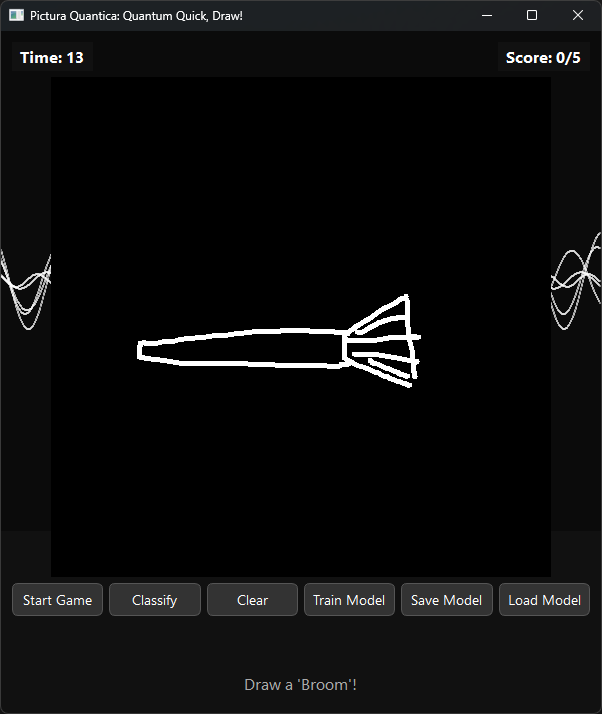
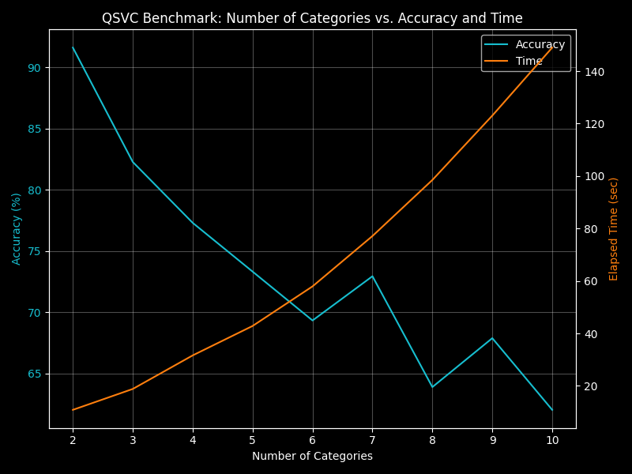
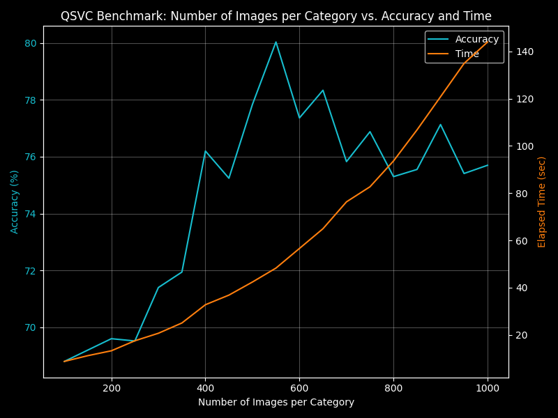
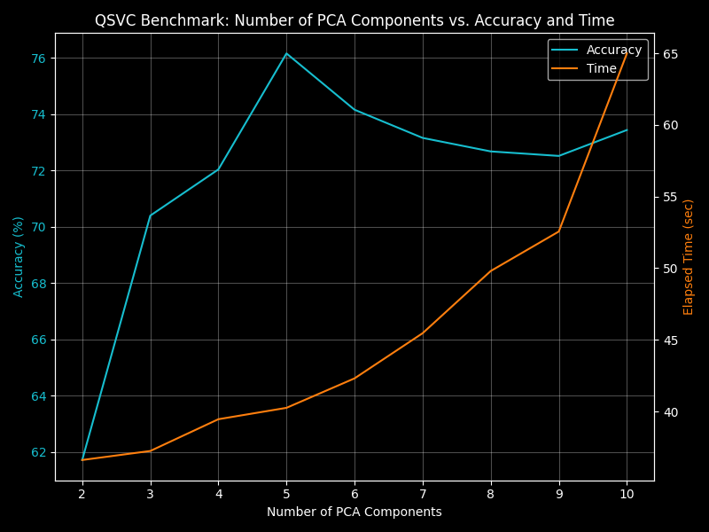
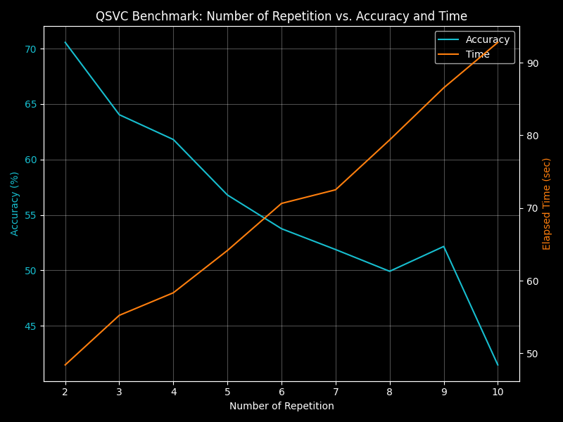
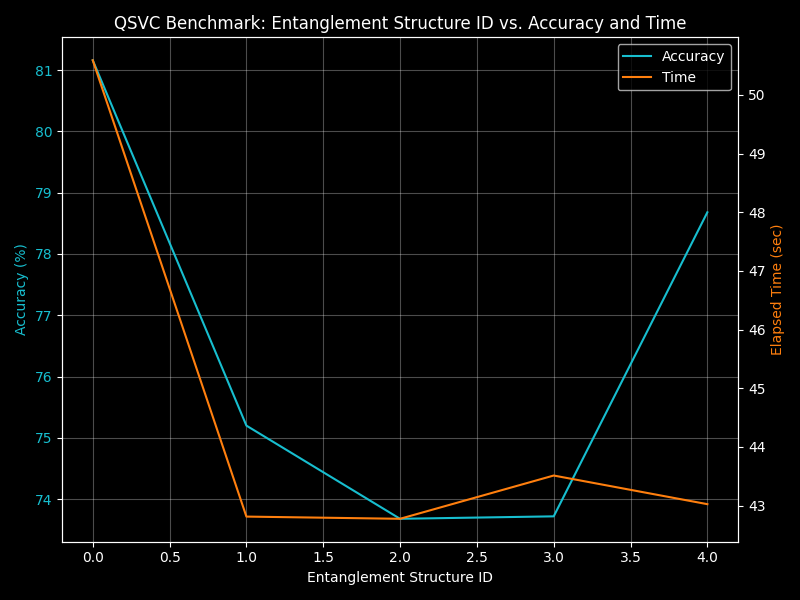

# Pictura Quantica

## Repository Description

This repository contains the files for the *Pictura Quantica* project.
Pictura Quantica is a gamified quantum image classifier inspired by [Quick, Draw!](https://quickdraw.withgoogle.com).
The project aims to provide a bridge between quantum machine learning and game-like, interactive experiences.
The model uses PCA and a quantum support vector classifier (QSVC).
This project was created for the *QPoland Global Quantum Hackathon 2025*.
The demonstraiton video can be found [here](./video/demonstratoin.mkv).


## Quick Start

1. This project targets a Windows environment. Make sure Python 3.10 or later is installed.
2. Clone this repository by running this command.
```sh
git clone https://github.com/Luxque/Pictura-Quantica.git
```
3. Change to the project directory and run the installer appropriate for your environment.
    * PowerShell (Windows):
    ```powershell
    cd .\Pictura-Quantica
    .\installation.ps1
    ```
    * To only set up the environment without launching the app:
    ```powershell
    .\installation.ps1 -NoRun
    ```
    * POSIX shells (Git Bash, WSL, macOS, Linux):
    ```bash
    cd ./Pictura-Quantica
    ./installation.sh
    ```
      * To set up without launching the app:
    ```bash
    ./installation.sh --no-run
    ```

The repository includes both `installation.ps1` (PowerShell) and `installation.sh` (POSIX). `installation.ps1` temporarily sets the PowerShell execution policy for the current process to allow activating the virtual environment; it does not change your system policy permanently.


## Usage

Before running classification tasks or playing the game, train a new model or load an existing one from [`model`](./model/).
Training a new model can take several minutes with the default settings and may temporarily make the application unresponsive.
A default model (trained by the author) is provided in [`model`](./model/); to use it, press the `Load Model` button.

For each round you must draw five objects that the model recognizes.
Correct guesses award one point and five extra seconds.
Incorrect guesses simply end that round without penalty.

Here are the explanations of each button:
* `Start Game`: Starts a new game.
* `Classify`: Classifies the drawing (check the answer during the game).
* `Clear`: Clears the drawing pad.
* `Train Model`: Train a new model using the dataset in [`dataset`](./dataset/).
* `Save Model`: Save the trained model to [`model`](./model/).
* `Load Model`: Load a model from [`model`](./model/).


## Features

* ✅ Quantum-inspired classification
* 🎨 Interactive drawing canvas (PyQt6)
* 🤖 Model training, saving, and loading
* ⚡ Animated background and smooth GUI
* 🎮 Gamification: timed rounds, scoring, accuracy feedback
* 🧩 Supports benchmark and augmentation modules


## Project Structure

* [`dataset`](./dataset/): Dataset used to train the sample model.
* [`figures`](./figures/): Benchmarking plots and screenshots.
* [`model`](./model/): Sample model, statistics, confusion matrix, and decision-region plots.
* [`source`](./source/): Source code for Pictura Quantica and the benchmarking module.
* [`video`](./video/): Short demonstration video of *Pictura Quantica*.


## Screenshot

<div align='center'>



</div>


## Benchmarks

<div align='center'>



</div>

<div align='center'>



</div>

<div align='center'>



</div>

<div align='center'>



</div>

<div align='center'>



</div>


## Dataset

This project uses the *Quick, Draw! Dataset* from Google, which contains millions of hand-drawn sketches across many categories.
The dataset is used to train and evaluate the quantum-based classifiers.

* Repository: [Quick, Draw! Dataset on GitHub](https://github.com/googlecreativelab/quickdraw-dataset)
* License: [Creative Commons Attribution 4.0 International (CC BY 4.0)](https://creativecommons.org/licenses/by/4.0/)
* Citation:
  > Google Creative Lab. *Quick, Draw! Dataset*.
  > Licensed under CC BY 4.0.
  > [https://github.com/googlecreativelab/quickdraw-dataset](https://github.com/googlecreativelab/quickdraw-dataset)

### Download Guide

To add more categories beyond the sample model, download additional dataset files (`.npy`) from [here](https://console.cloud.google.com/storage/browser/quickdraw_dataset/full/numpy_bitmap) and place them in [`dataset`](./dataset/).

1. Install the Google Cloud SDK (which provides `gsutil`).
2. Initialize the SDK and authenticate by using this command.
```sh
gcloud init
```
3. Change to the `Pictura-Quantica/dataset` directory.
4. Download the dataset files using `gsutil`.
```sh
gsutil -m cp gs://quickdraw_dataset/full/numpy_bitmap/*.npy .
```


## Contributing

Contributions, ideas, and bug reports are welcome.
Please open an issue or submit a pull request on the repository.


## Future Works

* Improve the GUI and fix bugs.
* Add an option to train a model on real quantum hardware.
* Implement a quantum PCA algorithm and integrate it into the project.


## License

MIT License.
